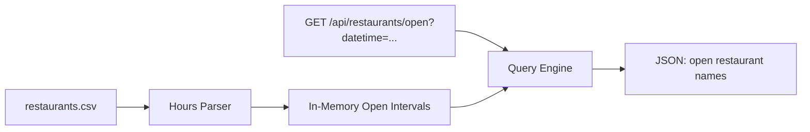
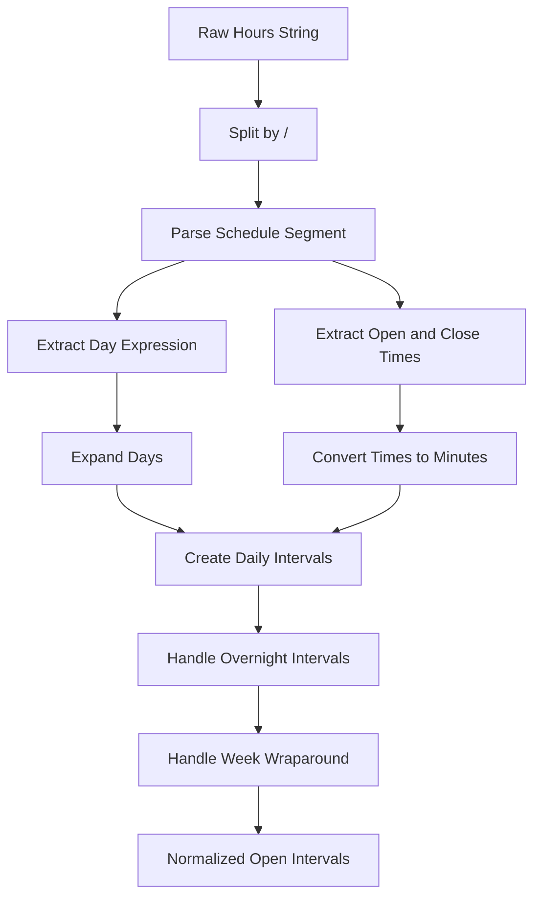
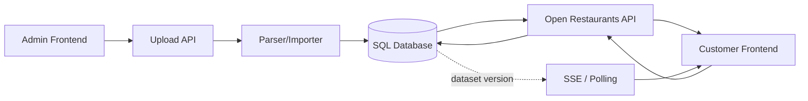

# Restaurant Hours API — Focused Engineering Submission Write-Up

# 1. Project Summary

The original assignment asks for an API endpoint that accepts a single datetime string and returns a list of restaurant names that are open at that date and time. The input data is a CSV file containing restaurant names and human-readable operating hours.

Instead of building around the assignment, this submission goes deep on it.

The focus is engineering depth on the parts that actually matter:

```text
- a robust hours parser
- a clean normalized representation
- a fast, correct query algorithm
- a single well-defined API endpoint
- thorough tests, including property-based parser tests
```

Everything outside that core is consciously cut or described in the documentation. The candidate considered an expanded product version with SQL persistence, CSV upload, dataset versioning, an admin frontend, simulated time controls, and live updates. That full vision is preserved in section 28 (Future Expansion) so the reviewer can see it was considered. None of it is built.

The result is a small submission where every piece is intentional and well-executed.

---

# 2. Core Assignment Requirement

The required functionality is:

```text
Build an API endpoint that takes a datetime string and returns restaurant names open at that date and time.
```

Example request:

```text
GET /api/restaurants/open?datetime=2026-05-06T21:30:00
```

Example response:

```json
[
  "The Cowfish Sushi Burger Bar",
  "Morgan St Food Hall",
  "Death and Taxes"
]
```

The original assignment also gives these assumptions:

```text
- If a day of the week is not listed, the restaurant is closed on that day.
- All times are local.
- Timezone awareness is not required.
- The CSV file is well-formed.
- Restaurant names and hours are assumed to be correct.
```

The most important technical challenge is not the API endpoint itself. The hard part is parsing human-readable hours into a reliable internal representation that can be queried accurately.

---

# 3. Submission Strategy

Two paths were on the table:

```text
Path B: Focused execution on the core assignment.
Path C: Expanded product with SQL, CSV upload, frontend, and simulated time mode.
```

Path B was chosen. The reasoning is below.

## 3.1 The 2026 Reality

In 2026, AI tools have collapsed the cost of generating code. Producing 2,000 lines of FastAPI, SQL models, a React frontend, and Docker Compose scaffolding is no longer a strong signal of capability. Anyone reviewing take-home submissions has seen plenty of large, AI-assisted projects that look impressive at a glance and start falling apart at the third edge case.

The senior signal has shifted. It now lives in two places:

```text
- what the candidate chose not to build
- how cleanly the chosen scope is executed
```

## 3.2 The Reviewer's Mental Model

A reviewer is likely going to spend 15 to 30 minutes per submission. They are not reading 40 files. They are scanning for whether the candidate solved the actual problem cleanly.

A focused submission lets the reviewer:

```text
- read the parser end to end
- read the query function end to end
- read the tests and see exactly what is being verified
- form a high-confidence opinion in a short window
```

A sprawling submission asks the reviewer to trust that the candidate handled the core well, while spending most of their time skimming infrastructure they did not ask for.

## 3.3 Surface Area and Verification Cost

More code means more places where AI-generated subtle bugs hide. Every additional layer (SQL session handling, migrations, upload validation, frontend state management) is another place the parser's edge cases can leak through unnoticed.

Fewer surfaces means each surface can be excellent. A single parser, a single query function, and a single endpoint can each be reviewed, tested, and trusted in full.

## 3.4 Win Condition

The win condition for this submission is:

```text
Every piece is intentionally chosen.
Every piece is well-executed.
Nothing is filler.
```

The full Path C vision is documented in section 28 (Future Expansion) so the reviewer can see the candidate understands what would be needed to scale this up. That vision was deliberately left out of the implementation.

---

# 4. Goals

The project should accomplish the following:

```text
- Correctly parse all human-readable hour formats, including ones not in the example CSV.
- Normalize parsed hours into queryable integer intervals using week-minute encoding.
- Expose a single, clean API endpoint that accepts a datetime and returns open restaurant names.
- Achieve comprehensive test coverage: parser unit tests, query integration tests, edge cases, persona-driven tests, and property-based parser tests.
- Document the parsing algorithm, normalization scheme, query algorithm, assumptions, edge cases, and boundary semantics.
- Use explicit half-open [start, end) interval semantics throughout, with the choice documented.
- Provide a Dockerfile that "just works" with docker build and docker run.
- Provide a README that includes a future-expansion roadmap, so the reviewer can see what would come next.
```

---

# 5. Non-Goals

The following are explicitly cut. Each is a deliberate prioritization, not laziness.

```text
- SQL persistence — the data is static for this assignment; parsing into memory at startup is the correct shape.
- CSV upload endpoint — the CSV is the program's static input, not a runtime concern.
- Admin UI — there is no admin role in the assignment.
- Customer-facing frontend — does not exercise the API in any way the tests do not already.
- Dataset versioning — there is one dataset; versioning solves a problem that does not exist here.
- Live Mode / Simulated Time Mode — the API already accepts arbitrary datetimes, which is the entire feature.
- next_change_at field — its own non-trivial algorithm; deferred and described in section 28.
- Authentication and authorization — no auth requirement in the assignment.
- Multi-location restaurants, cuisine filters, geo search — out of scope.
- Real-time third-party hour syncing — out of scope.
- Background job processing, observability tooling, migrations — none of it is exercised by the assignment.
```

These are described in section 28 (Future Expansion) so the reviewer can see the candidate understands what would be needed at scale, without paying the verification cost of building it.

---

# 6. Key Design Principle

The central design decision is:

```text
Parse complex human-readable hours once during data load.
Query simple normalized intervals at request time.
```

Do not repeatedly parse strings like this during every API request:

```text
"Mon-Thu, Sun 11:30 am - 10 pm / Fri-Sat 11:30 am - 11 pm"
```

Instead, convert the string into structured integer intervals when the CSV is loaded into memory at startup.

For example:

```text
Bida Manda
Mon-Thu, Sun 11:30 am - 10 pm / Fri-Sat 11:30 am - 11 pm
```

becomes normalized intervals like:

```text
Monday    11:30 → 22:00
Tuesday   11:30 → 22:00
Wednesday 11:30 → 22:00
Thursday  11:30 → 22:00
Friday    11:30 → 23:00
Saturday  11:30 → 23:00
Sunday    11:30 → 22:00
```

Each interval is then encoded as a pair of integers in the range 0 to 10079 (minutes since the start of the week). The query endpoint converts the input datetime to a single integer in that same space and runs a half-open interval comparison.

This decision shapes everything else in the architecture.
# 7. Architecture

The architecture for this approach is intentionally minimal. The CSV is treated as static program input, parsed once at startup, and held in memory as normalized intervals. There is no database, no upload endpoint, no frontend, and no background service.

The flow is a straight line:

```text
CSV File (static, loaded at startup)
  → Hours Parser
  → Normalized Open Intervals (in-memory)
  → Open Restaurants API
  → JSON response
```



There is one process. It boots, reads the CSV, parses each row into a list of normalized week-minute intervals, holds those intervals in memory, and serves a single endpoint that does an integer-range comparison against them.

---

## 7.1 Why no database

SQL was deliberately cut from this approach.

The reasons:

```text
- The CSV is static input, not user-editable runtime data.
- 40 restaurants is trivially small. There is no scale or query-performance argument for SQL.
- A SQL layer would add: schema design, migrations, ORM vs raw SQL choice, transactional concerns, test fixtures, and connection management.
- For static data, an in-memory list of intervals is more correct AND simpler.
- Adding SQL here would be cargo-cult engineering, not engineering judgment.
```

If the system later needed dataset versioning, admin upload, or multi-tenant isolation, SQL would become appropriate. That future state is described in section 28.

The point of approach B is to do less, but to do it with discipline. Cutting SQL is not a shortcut. It is a deliberate scoping decision that allows more attention to correctness, testing, and edge cases.

---

## 7.2 Component responsibilities

Each component has one job.

### Loader

```text
- Reads the CSV file at startup.
- Returns rows of (name, raw_hours).
- Does not parse hours. Does not validate hours.
```

### Parser

```text
- Converts a raw hours string into a list of normalized intervals.
- Handles day expressions, day ranges, comma-separated days, and multiple schedule segments.
- Handles AM/PM conversion and overnight wraparound.
- Pure function: same input always produces the same output.
```

### In-memory store

```text
- A list of restaurants.
- Each restaurant has: name, raw hours string, list of intervals.
- Built once at startup. Never mutated at runtime.
```

### Query engine

```text
- Converts a query datetime into a week-minute integer.
- Iterates the in-memory list and selects restaurants with at least one matching interval.
- Returns names in a stable order.
```

### API layer

```text
- One FastAPI route: GET /api/restaurants/open
- Pydantic validates the datetime query parameter.
- Calls the query engine.
- Serializes the result as JSON.
```

The boundaries are clean enough that each component can be tested in isolation without mocks.

---

# 8. Technology Choices

## 8.1 Backend: FastAPI

Recommended:

```text
FastAPI
```

Why FastAPI is the right pick for this approach:

```text
- Built-in request validation via Pydantic.
- Auto-generated OpenAPI docs at /docs (free signal of API hygiene).
- Strong async support (not strictly needed here but does not hurt).
- Excellent test ergonomics with TestClient.
- Modern, widely used, well-documented.
```

Flask would also work. FastAPI is preferred because the validation layer removes a category of hand-written input-checking code from the route handler.

---

## 8.2 Tests: pytest + Hypothesis

Recommended:

```text
pytest
pytest-cov
hypothesis (optional but valuable)
```

Why:

```text
- pytest for unit and integration tests across parser, intervals, and API.
- Hypothesis for property-based tests of the parser. The prompt says the solution should "account for hours not in the examples," which is exactly the case Hypothesis excels at.
```

Hypothesis can generate random but well-formed hours strings and assert invariants like:

```text
- Every interval has start < end.
- Every interval is contained in [0, 10080).
- Round-tripping a parsed interval back to a query at any minute inside it returns "open".
- A query at start - 1 minute returns "closed".
- A query at end returns "closed".
```

This is the kind of testing that genuinely demonstrates engineering depth on a take-home.

---

## 8.3 Datetime: Python stdlib datetime

Recommended:

```text
datetime.datetime
datetime.time
```

Why:

```text
- The assignment explicitly says timezones are not required.
- pendulum, arrow, and pytz solve problems this project does not have.
- Adding a third-party datetime library would be unnecessary surface area.
```

Stdlib datetime is enough. Day-of-week logic uses `datetime.weekday()` (Monday = 0).

---

## 8.4 Container: Docker

Recommended:

```text
Single-stage Dockerfile based on python:3.12-slim
```

Why:

```text
- One process. No DB. No separate services.
- docker-compose adds no value here.
- A 15-line Dockerfile is enough.
```

The Dockerfile copies the source, installs dependencies, copies the CSV, and runs uvicorn.

---

## 8.5 What's deliberately NOT chosen

The list of things this project does not include is just as important as the list of what it does include.

```text
- No SQLite. No Postgres. No database of any kind.
- No SQLAlchemy or any ORM.
- No Alembic or any migration tool.
- No frontend framework. No React. No HTML page.
- No Redis or other cache layer.
- No background workers. No Celery.
- No authentication.
- No CSV upload endpoint.
- No docker-compose.
- No pytest plugins beyond pytest-cov and hypothesis.
```

Each of these would add real cost: setup time, configuration complexity, additional test scaffolding, and reviewer cognitive load. None of them solve a problem this assignment actually has. Cutting them is the central design move of approach B.

---

# 9. Repository Structure

The repo layout is flat and small. There is no service layer, no models package, and no migrations folder.

```text
restaurant-hours-api/
  README.md
  Dockerfile
  pyproject.toml
  restaurants.csv

  app/
    __init__.py
    main.py              # FastAPI app + startup loader
    api.py               # Route handler for /restaurants/open
    loader.py            # CSV reading
    parser.py            # Hours-string parsing
    intervals.py         # Week-minute interval representation + query
    schemas.py           # Pydantic request/response models

  tests/
    test_parser_days.py
    test_parser_times.py
    test_parser_segments.py
    test_intervals.py
    test_api.py
    test_personas.py     # Persona-named integration tests
    test_property_based.py  # Hypothesis-driven parser tests
    test_edge_cases.py
    fixtures.py

  docs/
    algorithm.md
    edge-cases.md
    future-expansion.md
```

The structure is intentionally flat. Each module has one job. There are no service/model/schema layers proliferated unnecessarily; the system is small and should be organized to look small.

---

# 10. Data Modeling

There is no database schema. The data model lives in memory and is built once at startup.

Conceptual representation:

```python
# Conceptual representation, not exact code:
Restaurant = {
    "name": str,
    "raw_hours": str,        # original string from CSV
    "intervals": list[Interval],
}

Interval = {
    "start_week_minute": int,  # 0..10079
    "end_week_minute": int,    # 1..10080 (exclusive)
    "source_segment": str,     # the schedule segment this came from
}

restaurants: list[Restaurant]  # loaded at startup
```

A restaurant with no intervals is a valid (parseable but always-closed) state. The query engine treats it the same way it treats any restaurant whose intervals do not match the query: it is excluded from the result.

---

## 10.1 Why store the raw hours string

The raw string is kept on every Restaurant even though the parsed intervals are sufficient for querying.

Reasons:

```text
- Debugging and inspection. When something looks wrong, the original input is right there.
- Useful for an optional --inspect CLI tool that prints parsed intervals next to the source string.
- Useful for any error reporting that needs to mention which row produced a parser issue.
- The cost is one short string per restaurant. Trivial.
```

---

## 10.2 Why store source_segment per interval

Each normalized interval also carries the schedule segment it was produced from.

Example. Input:

```text
Mon-Thu 11 am - 11 pm / Fri-Sat 11 am - 12:30 am
```

The parser produces seven intervals. The Friday and Saturday intervals carry `source_segment = "Fri-Sat 11 am - 12:30 am"`. The Monday-through-Thursday intervals carry `source_segment = "Mon-Thu 11 am - 11 pm"`.

Reasons:

```text
- Lets any normalized interval be traced back to the segment that produced it.
- Crucial for debugging parser bugs in property-based tests.
- Free given the parser already has this information mid-pipeline.
- Adds one short string per interval. Negligible memory cost.
```

This is the kind of small, deliberate decision that distinguishes an engineering-depth submission from a code-the-spec submission.

---

# 11. Week-Minute Encoding

The whole system pivots on a single representation: every time within a week is encoded as a single integer in the range `[0, 10080)`.

```text
Monday    00:00 = 0
Monday    11:00 = 660
Tuesday   00:00 = 1440
Wednesday 00:00 = 2880
Thursday  00:00 = 4320
Friday    00:00 = 5760
Saturday  00:00 = 7200
Sunday    00:00 = 8640
Sunday    23:59 = 10079
```

There are 7 days × 24 hours × 60 minutes = 10080 minutes in a week. The whole week fits comfortably in a Python int.

Why this encoding works well for this problem:

```text
- The whole week fits in the int range [0, 10080).
- Open/closed becomes one comparison: start <= q < end.
- Overnight intervals just span beyond the end of a day. Mon 5pm-1:30am becomes 1020..1530, which crosses 1440 (Tuesday 00:00) cleanly.
- Sunday-to-Monday wraparound is handled by splitting into two intervals: Sun 20:00 → 10080 and Mon 00:00 → Mon 02:00. Each individual interval is well-formed.
- The query engine never has to reason about days of the week. It only does integer comparisons.
```

Half-open semantics:

```text
[start, end)
```

Meaning:

```text
- Open at the opening minute.
- Closed at the closing minute.
- Mon 11 am - 10 pm: open at 11:00, open at 21:59, closed at 22:00.
```

This boundary rule is documented and tested explicitly. It avoids the off-by-one ambiguity that comes with closed-closed intervals.

---

# 12. Normalized Interval Examples

The examples below show how raw hours strings become normalized week-minute intervals.

## 12.1 Simple same-day hours

Input:

```text
Mon 11 am - 10 pm
```

Normalized:

```text
Monday 11:00 → Monday 22:00
```

Stored:

```text
start_week_minute = 660
end_week_minute = 1320
```

---

## 12.2 Day range

Input:

```text
Mon-Fri 11 am - 10 pm
```

Normalized:

```text
Monday    11:00 → 22:00     (660 → 1320)
Tuesday   11:00 → 22:00     (2100 → 2760)
Wednesday 11:00 → 22:00     (3540 → 4200)
Thursday  11:00 → 22:00     (4980 → 5640)
Friday    11:00 → 22:00     (6420 → 7080)
```

Five intervals from one segment. The parser expands the day range into individual day intervals.

---

## 12.3 Multiple day groups

Input:

```text
Mon-Thu, Sun 11 am - 10 pm
```

Normalized:

```text
Monday    11:00 → 22:00
Tuesday   11:00 → 22:00
Wednesday 11:00 → 22:00
Thursday  11:00 → 22:00
Sunday    11:00 → 22:00
```

Friday and Saturday get no interval. They are closed.

---

## 12.4 Multiple schedule segments

Input:

```text
Mon-Thu 11 am - 11 pm / Fri-Sat 11 am - 12:30 am / Sun 10 am - 11 pm
```

Normalized:

```text
Monday    11:00 → 23:00
Tuesday   11:00 → 23:00
Wednesday 11:00 → 23:00
Thursday  11:00 → 23:00
Friday    11:00 → Saturday 00:30
Saturday  11:00 → Sunday 00:30
Sunday    10:00 → 23:00
```

Seven intervals. The Friday and Saturday intervals each cross midnight into the next day; this is handled by the overnight rule below.

---

## 12.5 Overnight hours

Input:

```text
Mon 5 pm - 1:30 am
```

Normalized:

```text
Monday 17:00 → Tuesday 01:30
```

Stored:

```text
start_week_minute = 1020
end_week_minute = 1530
```

Rule:

```text
If closing time is less than or equal to opening time, treat closing time as the next day.
```

The end value (1530) is greater than the start value (1020) and the end falls inside Tuesday's range. The query engine has nothing special to do.

---

## 12.6 Sunday-to-Monday wraparound

Input:

```text
Sun 8 pm - 2 am
```

This crosses the week boundary. The naive normalization would be `Sunday 20:00 → Monday 02:00`, which translates to `8880 → 10200` — but 10200 is outside the valid range `[0, 10080]`.

Stored as TWO intervals to keep querying simple:

```text
Sunday 20:00 → end of week     (8880 → 10080)
Monday 00:00 → Monday 02:00    (0 → 120)
```

Both intervals are well-formed. The query engine still does a single integer-range comparison and does not need to know that these two intervals belong to the same logical opening.
# 13. Parsing Strategy

The parser is the heart of the assignment. The whole engineering case rests on it being correct, well-structured, and easy to reason about. Everything downstream — the API, the query logic, the tests — gets simpler when the parser does its job cleanly.

The high-level pipeline:

```text
Raw hours string
→ split by '/' into schedule segments
→ for each segment:
    → split into day expression and time expression
    → expand day expression into individual days
    → parse open/close times into minutes-of-day
    → for each day:
        → compute start_week_minute and end_week_minute
        → handle overnight (close <= open → close belongs to next day)
        → handle Sunday-to-Monday wraparound (split into two intervals)
→ collect all intervals into the restaurant's interval list
```

Visualized:



Each step has one responsibility. Each step is unit-testable in isolation.

---

# 14. Schedule Segment Splitting

The first transformation is the cheapest. The `/` character separates schedule blocks within a single hours string.

Example:

```text
Input:  Mon-Thu 11 am - 10 pm / Fri-Sat 11 am - 12 am
Split:  ["Mon-Thu 11 am - 10 pm", "Fri-Sat 11 am - 12 am"]
```

Each segment can then be parsed independently and the results combined into the restaurant's full interval list.

Edge cases worth deciding upfront:

```text
- Whitespace around '/' should be tolerated (split, then strip each segment)
- Multiple consecutive '/' characters can raise a parser error or be normalized
- An empty string segment after splitting is treated as a parser error
```

Pick one documented behavior for malformed separators and stick with it. The README should say what the parser does when it sees `Mon 11 am - 10 pm //  Fri 5 pm - 11 pm`.

---

# 15. Day Expression Parsing

The day expression is the part of a segment before the time range. It can be a single day, a range, a comma-separated list, or any combination of those.

Supported day tokens:

```text
Mon, Tue, Tues, Wed, Thu, Thurs, Fri, Sat, Sun
Monday, Tuesday, Wednesday, Thursday, Friday, Saturday, Sunday
```

Supported ranges:

```text
Mon-Fri        — explicit range
Sat-Sun        — weekend
Fri-Mon        — circular range that wraps Saturday, Sunday, Monday
Mon-Sun        — full week
```

Supported comma-separated combinations:

```text
Mon, Wed-Sun           — Mon plus Wednesday through Sunday (skipping Tuesday)
Mon-Thu, Sun           — Monday through Thursday plus Sunday
Tues-Fri, Sun          — handles "Tues" abbreviation
```

The original prompt explicitly says the candidate should account for restaurant hours not included in the examples. Supporting full day names, the `Tues` and `Thurs` 4-letter abbreviations, ranges, circular ranges, and comma-separated groups makes the parser resilient to inputs the candidate has never seen.

---

## 15.1 Implementation note

A small amount of structure makes the day parser bulletproof:

```text
- Maintain a canonical day list ["Mon", "Tue", "Wed", "Thu", "Fri", "Sat", "Sun"] indexed 0-6
- Build a lookup map of all accepted spellings to canonical index
- For ranges, walk forward from start to end, wrapping at index 6 → 0 to support Fri-Mon
```

The lookup table approach also makes case-insensitive matching trivial — normalize the token to lowercase before the dictionary lookup.

---

# 16. Time Parsing

Times appear in many forms in real-world hours strings. The parser should accept all of these:

```text
11 am
11:00 am
11:30 am
10 pm
10:30 pm
12 am  (midnight)
12 pm  (noon)
12:30 am
1:30 am
```

The 12 am / 12 pm cases are the only ones that trip people up:

```text
12:00 am = 00:00
12:30 am = 00:30
12:00 pm = 12:00
12:30 pm = 12:30
```

The conversion rule, written out explicitly:

```text
- Hours 1-11 with "am" → unchanged hour
- Hour 12 with "am" → hour 0
- Hours 1-11 with "pm" → hour + 12
- Hour 12 with "pm" → unchanged hour
```

Each parsed time becomes minutes-after-midnight (0..1439). A handful of worked examples:

```text
11 am    = 660
11:30 am = 690
10 pm    = 1320
12 am    = 0
12:30 am = 30
1:30 am  = 90
```

These conversions deserve their own focused unit tests. The 12 am case in particular is the most common bug source, so it should have explicit assertions.

---

# 17. Open/Closed Query Strategy

At query time, the input datetime is converted into a `query_week_minute` and matched against the precomputed intervals.

```text
query_week_minute = weekday_index * 1440 + hour * 60 + minute
```

Where Monday = 0, Tuesday = 1, ..., Sunday = 6.

Worked example for Wednesday 9:30 PM:

```text
weekday_index = 2 (Wednesday)
query_week_minute = 2 * 1440 + 21 * 60 + 30 = 4170
```

Then for each restaurant interval, the check is:

```text
start_week_minute <= query_week_minute < end_week_minute
```

This is the half-open `[start, end)` rule. A restaurant is included in the response if any of its intervals matches.

---

## 17.1 Boundary semantics

The boundary behavior should be documented explicitly so a reviewer can predict the answer for any edge case.

```text
Mon 11 am - 10 pm
```

Behavior:

```text
Monday 10:59 am = closed
Monday 11:00 am = open
Monday 9:59 pm  = open
Monday 10:00 pm = closed
```

Open exactly at opening time. Closed exactly at closing time. This matches the standard interpretation of business hours and is consistent with the half-open interval rule used throughout the parser.

---

# 18. Query Implementation

The whole query, expressed as Python pseudo-code:

```python
def open_restaurants(query_dt: datetime) -> list[str]:
    q = to_week_minute(query_dt)
    return sorted(
        r.name
        for r in restaurants
        if any(i.start <= q < i.end for i in r.intervals)
    )
```

That's the entire runtime. No string parsing, no datetime arithmetic beyond the one `to_week_minute` call, no SQL. Just integer comparisons.

---

## 18.1 Performance

```text
- 40 restaurants × ~5-10 intervals each = ~300 interval comparisons per query
- Linear scan is correct and fast enough; no sorting or indexing needed
- If the dataset grew to thousands of restaurants, an interval index (sorted by
  start, binary search for first candidate) would help
```

The interval index is worth mentioning in the README as a "could-add-later" note, not as something to build. Adding it now would be over-engineering for the data scale.

---

## 18.2 Why startup-only loading is fine

```text
- The CSV is read once when the FastAPI app starts
- Parsing happens once
- Subsequent queries just hit the in-memory list
- Restart the process to re-read the CSV (this matches the assignment's static-input model)
```

The assignment treats the CSV as a static file. There's no ingestion endpoint, no admin upload flow, no expectation that the data changes during a process's lifetime. Loading at startup is the simplest model that fits the problem.

---

# 19. API Design

The API has exactly one endpoint:

```text
GET /api/restaurants/open?datetime=2026-05-06T21:30:00
```

That's it. One route, one query parameter, one response.

---

## 19.1 Request validation

```text
- datetime is a required query parameter
- Must parse as ISO 8601 (Pydantic handles this for free in FastAPI)
- Invalid datetime → 422 with a clear error body
- Missing parameter → 422
```

FastAPI plus Pydantic does all of this automatically based on the route's type hints. The candidate doesn't need to write validation code by hand.

---

## 19.2 Response shape

The simple form, matching the brief verbatim:

```json
[
  "The Cowfish Sushi Burger Bar",
  "Morgan St Food Hall",
  "Death and Taxes"
]
```

The richer form, recommended as polish:

```json
{
  "datetime": "2026-05-06T21:30:00",
  "weekday": "Wednesday",
  "open": [
    "Death and Taxes",
    "Morgan St Food Hall",
    "The Cowfish Sushi Burger Bar"
  ],
  "count": 3
}
```

The richer form is recommended because:

```text
- Echoing the query datetime helps frontends ignore stale responses
- weekday and count are zero-cost and aid debugging
- The shape is still simple and not over-engineered
```

If there is concern about deviating from the literal brief, the candidate can offer the simple form at `/api/restaurants/open` and the richer form at `/api/restaurants/open?verbose=true`, or vice versa. Either is defensible.

---

## 19.3 Error responses

```text
- 422 for invalid datetime
- 200 with empty open: [] if no restaurants match (not an error)
- 500 only for genuine server errors (which should never happen for this assignment)
```

"No restaurants are open at 4 AM Tuesday" is not an error. It's an empty list. This distinction matters and should be reflected in the tests.

---

## 19.4 OpenAPI docs

FastAPI auto-generates `/docs` and `/openapi.json` from the route signatures and Pydantic models. This comes for free and signals API hygiene. The README should mention `/docs` as the way to interactively try the endpoint without needing to build a curl command.

---

# 20. Optional CLI for Inspection

A small utility — `python -m app.inspect restaurants.csv` — that loads the CSV and prints each restaurant with its parsed intervals in human-readable form. This is not required by the assignment, but it's a strong polish touch.

Example output:

```text
$ python -m app.inspect restaurants.csv

The Cowfish Sushi Burger Bar
  Mon 11:00 → 22:00 (660..1320)
  Tue 11:00 → 22:00 (2100..2760)
  ...

Bonchon
  Mon 17:00 → Tue 00:30 (1020..1470)
  ...
```

Why include it:

```text
- Demonstrates parser correctness without running the API
- Useful for the candidate during development to verify edge cases
- Useful for the reviewer to verify parser behavior at a glance
- Tiny code surface (~30 lines)
```

The CLI is the kind of detail that makes the project feel finished. It costs almost nothing and it gives anyone reviewing the submission a fast, no-setup way to confirm the parser is doing the right thing.
# 21. Personas as Quality Shapers

There are two ways to use personas when scoping a take-home submission.

```text
Two ways to use personas:

1. Personas as scope-shapers — each persona justifies a new feature.
   Result: more code, more components, more verification surface.

2. Personas as quality-shapers — each persona stress-tests the existing
   functionality. Result: a single interface that demonstrably serves
   multiple jobs.
```

This submission uses approach #2.

The single endpoint built for the assignment is asked to serve multiple realistic users. Each persona forces a question about how the endpoint behaves under their specific input pattern, and the answer becomes a test.

---

## 21.1 Marcus the Hungry Customer

Goal:

```text
Find a restaurant open right now.
```

Marcus passes the current local datetime to the endpoint and gets a list back.

How served by B:

```text
Directly. No new code.
```

Quality contribution:

```text
- Stress-tests the "now" path
- Exercises typical weekday math
- Usually no overnight edge case
- Confirms the most common request shape works
```

---

## 21.2 Priya the Late-Night Planner

Goal:

```text
Find restaurants open at Friday 11:30 PM or Saturday 1:00 AM.
```

Priya is the persona who breaks naive implementations. Her queries land in the overnight band where intervals from one day extend into the next.

How served by B:

```text
Directly. The endpoint accepts arbitrary datetimes.
```

Quality contribution:

```text
- Stress-tests overnight intervals
- Stress-tests Sunday-to-Monday wraparound
- Stress-tests the half-open boundary at the closing minute
- Forces the parser to split intervals across the week boundary correctly
```

---

## 21.3 Leo the Frontend Developer

Goal:

```text
Build a UI on top of the API.
```

Leo needs predictable request and response shapes, clear error semantics, and a stable datetime format he can trust.

How served by B:

```text
Directly via the response shape and OpenAPI docs at /docs.
```

Quality contribution:

```text
- Forces explicit decisions about response shape
- Echoes the query datetime back so async UIs can detect stale responses
- Includes weekday for debugging
- Returns 422 for invalid datetimes
- Returns 200 with an empty list for "nothing open"
```

---

## 21.4 Dana the Operations Admin

Goal:

```text
Upload a new CSV when restaurant hours change.
```

How served by B:

```text
NOT served. Dana motivates CSV upload, dataset versioning,
admin UI, and SQL persistence.
```

This submission deliberately does not serve Dana, because Dana's role does not exist in the take-home assignment. The CSV is static input. There is no admin user. Building for Dana would be building for a user the assignment did not ask about.

Dana's needs are described in section 28 (Future Expansion) as the roadmap if this code became a managed service.

---

# 22. Persona-Driven Test Naming

Tests named after personas. This is the heart of "personas as quality-shapers."

Examples:

```text
test_marcus_open_now_evening
test_marcus_open_now_morning
test_marcus_returns_empty_when_nothing_open
test_priya_friday_late_night_overnight
test_priya_saturday_one_am_uses_friday_interval
test_priya_sunday_eight_pm_to_monday_two_am_wraparound
test_leo_invalid_datetime_returns_422
test_leo_response_includes_query_datetime
test_leo_response_is_sorted_alphabetically
```

These are integration tests against the FastAPI `TestClient`, separate from unit tests of the parser and interval engine.

They serve two purposes:

```text
- Functional verification of the user-facing behavior
- Documentation in the test names — a reviewer skimming
  the test file immediately understands what kind of users
  the API was built to serve
```

---

# 23. Edge Cases to Document and Test

Every edge case below has an input, a documented behavior, and a one-line note about why it matters. Each one is covered by a test in the suite.

## 23.1 Omitted Days

Assumption:

```text
If a day is not listed, the restaurant is closed.
```

Example:

```text
Centro: Mon, Wed-Sun 11 am - 10 pm
```

Tuesday is closed. No interval is created for Tuesday.

Why it matters:

```text
The assignment states this rule explicitly. A reviewer will check it.
```

---

## 23.2 Opening Boundary

Input:

```text
Mon 11 am - 10 pm
```

Behavior:

```text
Monday 11:00 AM = open
```

Half-open `[start, end)` semantics. The opening minute is included.

---

## 23.3 Closing Boundary

Input:

```text
Mon 11 am - 10 pm
```

Behavior:

```text
Monday 10:00 PM = closed
```

The closing minute is excluded. This is the half-open convention applied consistently.

---

## 23.4 Overnight Hours

Input:

```text
Mon 5 pm - 1:30 am
```

Behavior:

```text
Monday 6:00 PM = open
Tuesday 1:00 AM = open
Tuesday 1:30 AM = closed
```

Why it matters:

```text
The naive "compare hours within a single day" implementation fails here.
The week-minute representation handles it without special cases.
```

---

## 23.5 All-Week Overnight Hours

Input:

```text
Seoul 116: Mon-Sun 11 am - 4 am
```

Every day's closing time spills into the next morning.

Behavior:

```text
Tuesday 2:00 AM = open  (covered by Monday 11 AM - Tuesday 4 AM)
Tuesday 5:00 AM = closed
```

This is the case that tends to expose bugs in implementations that store intervals per-day instead of per-week.

---

## 23.6 Sunday-to-Monday Wraparound

Input:

```text
Sun 8 pm - 2 am
```

Splits into two intervals:

```text
Sunday 20:00 → end of week (week-minute 10080)
Monday 00:00 → 02:00
```

Behavior:

```text
Sunday 9:00 PM = open
Monday 1:00 AM = open
Monday 2:00 AM = closed
```

The week is treated as a circular buffer of 10,080 minutes, but the storage representation splits the wraparound interval to keep the runtime check a simple `start <= q < end`.

---

## 23.7 12 AM and 12 PM Edge

Conversions:

```text
12 am  = 00:00
12 pm  = 12:00
12:30 am = 00:30
12:30 pm = 12:30
```

Why it matters:

```text
This is the most common bug in time parsers. A reviewer will test it.
```

---

## 23.8 Multiple Schedule Segments

Input:

```text
Mon-Thu 11 am - 10 pm / Fri-Sat 11 am - 12:30 am / Sun 10 am - 11 pm
```

Each segment is parsed independently and contributes its own intervals.

---

## 23.9 Day Ranges with Commas

Input:

```text
Mon-Thu, Sun 11 am - 10 pm
```

Expands to:

```text
Monday, Tuesday, Wednesday, Thursday, Sunday
```

No interval is created for Friday or Saturday.

---

## 23.10 Circular Day Range

Input:

```text
Fri-Mon 5 pm - 11 pm
```

Expands to:

```text
Friday, Saturday, Sunday, Monday
```

The parser's range expander wraps from index 6 (Sunday) back to index 0 (Monday). This is supported because the assignment says the parser should handle hours not in the example dataset.

---

## 23.11 Closes Exactly At Midnight

Input:

```text
Mon-Sun 5 pm - 12 am
```

Here `12 am` is the END of the night, not the beginning.

Convention:

```text
Treat closing time of "12 am" as 24:00 (= next day 00:00)
to keep the half-open rule consistent.
```

Documented explicitly in `docs/edge-cases.md`. Without this rule, the parser would interpret `5 pm - 12 am` as a zero-length interval that immediately wraps backward through the entire day.

---

# 24. Testing Strategy

Layered tests. Each layer has a different blast radius and different reasons to fail.

## 24.1 Parser Unit Tests

Tests for the parser's individual responsibilities. Each test is named for the specific behavior it verifies.

```text
test_parse_time_handles_12_am_as_zero
test_parse_time_handles_12_pm_as_noon
test_parse_time_handles_no_minutes
test_parse_time_handles_minutes
test_expand_days_supports_circular_range
test_expand_days_handles_tues_and_thurs
test_expand_days_handles_full_names
test_split_segments_tolerates_whitespace
test_split_segments_returns_one_when_no_slash
```

---

## 24.2 Interval Engine Unit Tests

Tests for the week-minute conversion and the open-at-query-time check. Boundary cases tested explicitly.

```text
test_week_minute_for_monday_midnight_is_zero
test_week_minute_for_sunday_2359_is_10079
test_overnight_interval_splits_across_week_boundary
test_query_at_opening_minute_returns_open
test_query_at_closing_minute_returns_closed
test_query_one_minute_before_opening_returns_closed
```

---

## 24.3 Full Pipeline Tests

End-to-end tests that load a small fixture CSV and assert specific restaurants are open at specific datetimes. These catch integration bugs that unit tests cannot see.

---

## 24.4 Persona-Driven Integration Tests

See section 22.

---

## 24.5 Property-Based Tests with Hypothesis

The prompt says the solution should account for hours not in the examples. Property-based testing is the right fit for this. Hypothesis generates random valid hour strings and verifies invariants.

```text
For any randomly-generated valid hour string:
  - parsing succeeds without exception
  - the resulting intervals are within [0, 10080)
  - intervals don't have negative spans
    (or properly span the wraparound)
  - re-parsing the round-tripped string produces
    the same intervals
```

This is a lot of confidence for a small amount of code.

---

## 24.6 What's NOT Tested

```text
- Performance benchmarks (40 restaurants is trivial; documented but
  not benchmarked)
- Concurrency (no shared mutable state at runtime)
- Database integration (no database)
```

Naming what is not tested is a senior signal. It tells the reviewer that the omission was a decision, not an oversight.

---

# 25. Docker and Local Development

## 25.1 Dockerfile

A single-stage Dockerfile based on `python:3.12-slim`.

It should:

```text
- Use a slim base image
- Set a working directory
- Install dependencies (uv or pip from pyproject.toml or requirements.txt)
- Copy source and the CSV
- Expose port 8000
- Run uvicorn against the FastAPI app
```

A single Dockerfile is the right shape because there are no other services.

---

## 25.2 Why No docker-compose

```text
- No database service
- No frontend service
- No additional infrastructure
```

`docker-compose.yml` is the right shape when there are multiple services to orchestrate. Adding it here would be performative.

---

## 25.3 Local Development Without Docker

```text
uv pip install -e .         (or pip install -r requirements.txt)
uvicorn app.main:app --reload
pytest
```

Three commands. No setup script. No environment file. No database to initialize.

---

# 26. Documentation Plan

## 26.1 README Structure

```text
1. Overview (what this is, what it does)
2. Quick start (run with Docker, run locally)
3. The endpoint (request/response, examples)
4. The algorithm (parse-once, week-minute encoding)
5. Edge cases (link to docs/edge-cases.md)
6. Testing (how to run, what's covered)
7. Future expansion (link to docs/future-expansion.md)
8. Design decisions (why no SQL, why no frontend)
```

---

## 26.2 In-Repo Docs

```text
docs/algorithm.md       — week-minute encoding, query algorithm,
                          half-open semantics
docs/edge-cases.md      — every edge case with input, behavior,
                          and rationale
docs/future-expansion.md — the C vision; mirrors section 28
                          of this document
```

The split keeps the README scannable. A reviewer who wants depth follows the links. A reviewer who only wants to run the project finds the quick start at the top.

---

# 27. Production-Roadmap as a First-Class Artifact

The future-expansion documentation is itself a deliverable, not an apology for what wasn't built.

Framing:

```text
Articulating the design of the larger system demonstrates the same
engineering thinking with none of the verification cost. The reviewer
can read it and form a complete picture of how this code would scale
into a managed service.
```

This reframes the omitted features. They are not missing. They are designed and described, with the implementation deliberately deferred.

---

# 28. Future Expansion (The Full Vision, Not Built)

This section describes how the focused implementation would evolve into a managed service. None of it is built. All of it is documented in `docs/future-expansion.md` so that a reviewer can read the complete vision without having to verify any additional code.

## 28.1 SQL-Backed Ingestion

Switch from in-memory to Postgres or SQLite.

Schema:

```sql
imports
-------
id
filename
status
row_count
error_message
created_at
activated_at
is_active

restaurants
-----------
id
import_id
name
raw_hours

open_intervals
--------------
id
restaurant_id
start_week_minute
end_week_minute
source_text
```

Versioned imports. New uploads create a new import row and a new set of restaurants. The previous active dataset is marked inactive only after the new one parses cleanly.

---

## 28.2 CSV Upload Endpoint

```text
POST /imports
Content-Type: multipart/form-data
```

Behavior:

```text
- Parse all rows in a single transaction
- Insert restaurants and intervals
- Mark the new import active only if every row parsed cleanly
- Roll back on any parse failure
- Status field: pending / active / failed / superseded
```

This is the transactional activation pattern that prevents a bad upload from breaking the customer-facing endpoint.

---

## 28.3 Admin UI

A small page with:

```text
- Upload screen with parsed-restaurants preview
- Active dataset display (version, row count, upload time)
- Failed import error reporting
- History of past uploads
```

This serves Dana the Operations Admin from the personas list.

---

## 28.4 Customer-Facing UI

Two modes:

```text
- Live Mode (uses local clock)
- Simulated Time Mode (date and time picker;
  demonstrates overnight correctness)
```

Plus:

```text
- Time slider for exploring a day
- next_change_at field on the API response so the frontend
  can schedule efficient refreshes instead of polling
```

---

## 28.5 Production Architecture



The shape is recognizable: a write-side ingestion path, a read-side query path, a shared store, and a versioning channel that lets the frontend detect new datasets.

---

## 28.6 Closing Paragraph

Describing this in documentation rather than implementing it within a take-home is itself the engineering decision. Implementation would multiply the surface area of code that must be reviewed and verified, in service of features the assignment doesn't ask for. The articulated design demonstrates the same depth of thinking with none of the verification cost.

---

# 29. Recommended Scope Control

A tier system that names what the submission targets and what it deliberately defers.

## 29.1 Tier 1 (Must Be Excellent)

```text
- Correct parser
- Correct open/closed logic
- API endpoint with explicit half-open semantics
- Comprehensive tests
- Sharp README
```

---

## 29.2 Tier 2 (Selective Polish)

```text
- Dockerfile
- Property-based parser tests with Hypothesis
- Optional --inspect CLI for parsed intervals
- API response shape that supports stale-response detection
- OpenAPI docs at /docs (free with FastAPI)
```

These are bonuses where the cost is small relative to the signal.

---

## 29.3 Tier 3 and 4 (Deferred to Future Expansion Docs)

```text
- SQL persistence
- CSV upload endpoint
- Admin UI
- Customer-facing frontend
- Live and Simulated Time Mode
- next_change_at field
- Server-Sent Events for dataset versioning
```

These are described in `docs/future-expansion.md` instead of implemented.

---

> The 2026 reality is that AI tools have collapsed the cost of generating code. The bar for engineering judgment has correspondingly risen. A submission that includes "everything you could think of" reads as undisciplined. A focused submission that names what was cut and why reads as senior.

---

# 30. Positioning Statement

> This project implements the required restaurant open-hours API with deep engineering focus on the parsing and query algorithm. The core design decision is to parse hours once during data load and normalize them into weekly open intervals encoded as integers, reducing the runtime query to a single integer-range comparison.
>
> The submission deliberately stays narrow. There is no SQL database, no CSV upload endpoint, no frontend — these would solve problems the assignment doesn't have. A "Future Expansion" section in the documentation describes how the system would evolve into a managed service: SQL-backed ingestion, transactional dataset versioning, an admin upload UI, and a customer-facing frontend with Live and Simulated Time modes.
>
> Choosing what not to build is the central engineering decision. The expanded vision is articulated; the focused implementation is delivered.

---

# 31. Final System Concept

The data flow:

```text
restaurants.csv (static input)
→ Hours Parser (run once at startup)
→ In-memory list of restaurants with normalized week-minute intervals
→ GET /api/restaurants/open?datetime=...
→ Convert datetime to query_week_minute
→ Linear scan: any interval where start <= q < end
→ JSON response
```

What was added beyond the bare minimum:

```text
- Persona-driven integration test naming
- Property-based parser tests with Hypothesis
- Half-open [start, end) interval semantics, documented and tested
- Comprehensive edge case coverage (overnight, Sunday wraparound,
  12am/12pm, omitted days, circular ranges)
- Dockerfile that "just works"
- OpenAPI docs at /docs (free)
- Optional --inspect CLI for parsed intervals
- A complete future-expansion roadmap document
```

Focused doesn't mean minimal. Focused means every component does what it should and nothing more. The submission is small in surface area and large in engineering depth — which is exactly the signal a 2026 take-home reviewer is looking for.
